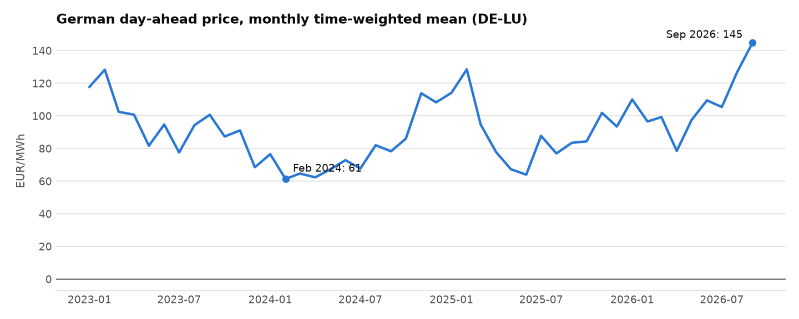
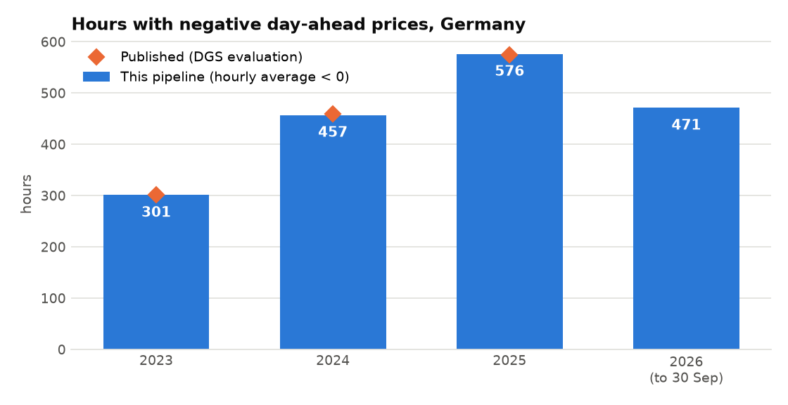
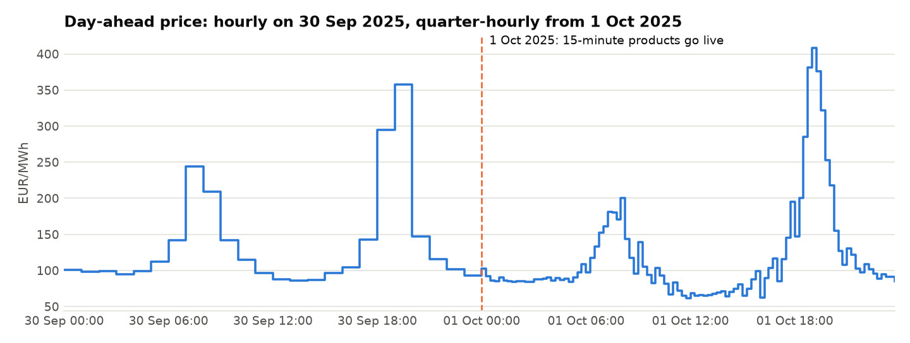
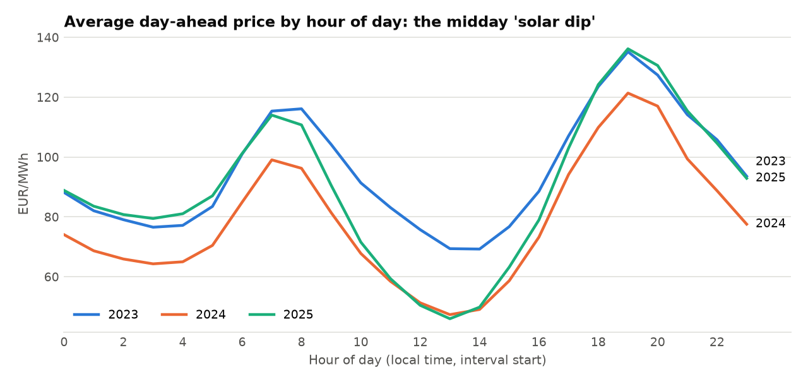

# Day 1 report: German day-ahead market data

Generated 2026-10-08 09:59 UTC by `ppa-lab report`.
Data: CC BY 4.0 - Bundesnetzagentur | SMARD.de, via Energy-Charts (Fraunhofer ISE). Bidding zone DE-LU,
delivery days 2023-01-01 to 2026-09-30 (local time, Europe/Berlin).

## 1. Data quality

**23 pass, 1 warn, 0 fail.**
Full details: [data_quality.md](data_quality.md).

## 2. Reconciliation with published figures

| metric             |   year |   ours |   published |   difference |   tolerance | status               |
|:-------------------|-------:|-------:|------------:|-------------:|------------:|:---------------------|
| mean_price_eur_mwh |   2025 |  89.32 |       89.32 |         0    |         0.5 | within tolerance     |
| mean_price_eur_mwh |   2024 |  78.51 |       79.46 |        -0.95 |         0.5 | explained difference |
| mean_price_eur_mwh |   2023 |  95.18 |       95.18 |        -0    |         0.5 | within tolerance     |
| negative_hours     |   2025 | 576    |      575    |         1    |         5   | within tolerance     |
| negative_hours     |   2024 | 457    |      459    |        -2    |         5   | within tolerance     |
| negative_hours     |   2023 | 301    |      301    |         0    |         5   | within tolerance     |

Sources: 2025 mean_price_eur_mwh: netztransparenz.de annual spot market value 2025 = 8.932 ct/kWh (DGS evaluation, Jan 2026); 2024 mean_price_eur_mwh: netztransparenz.de Jahresmarktwert JW 2024 = 7.946 ct/kWh; 2023 mean_price_eur_mwh: netztransparenz.de Jahresmarktwert JW 2023 = 9.518 ct/kWh; 2025 negative_hours: DGS evaluation of 2025 market values: 575 h with negative prices (pv magazine reports 573 h); 2024 negative_hours: DGS evaluation: 459 h in 2024 (other sources report 457 h); 2023 negative_hours: DGS evaluation: 301 h in 2023.

Explained differences:

- **2024 mean_price_eur_mwh:** All of the difference comes from June 2024 (every other month matches to 0.000 ct/kWh). On 26 Jun 2024 SDAC was partially decoupled; EEG section 3 no. 42a then prescribes the volume-weighted average of all exchanges (EPEX cleared about 492 EUR/MWh, Nord Pool about 103), while our source carries about 103 EUR/MWh for that day.

## 3. Annual statistics

|   Year | First day   | Last day   |   Mean price (EUR/MWh) |     Min |    Max |   Negative hours |   Hours with any negative interval |   Negative time (h) |   Longest negative streak (h) |
|-------:|:------------|:-----------|-----------------------:|--------:|-------:|-----------------:|-----------------------------------:|--------------------:|------------------------------:|
|   2023 | 2023-01-01  | 2023-12-31 |                  95.18 | -500.00 | 524.27 |              301 |                                301 |              301.00 |                            36 |
|   2024 | 2024-01-01  | 2024-12-31 |                  78.51 | -135.45 | 936.28 |              457 |                                457 |              457.00 |                            18 |
|   2025 | 2025-01-01  | 2025-12-31 |                  89.32 | -250.32 | 583.40 |              576 |                                588 |              574.75 |                            20 |
|   2026 | 2026-01-01  | 2026-09-30 |                 107.72 | -499.99 | 747.10 |              471 |                                558 |              463.25 |                            18 |

## 4. Charts

