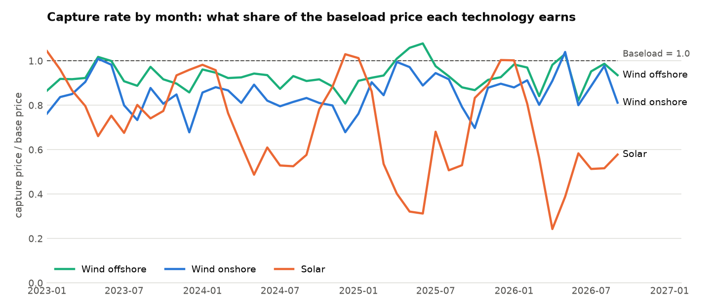
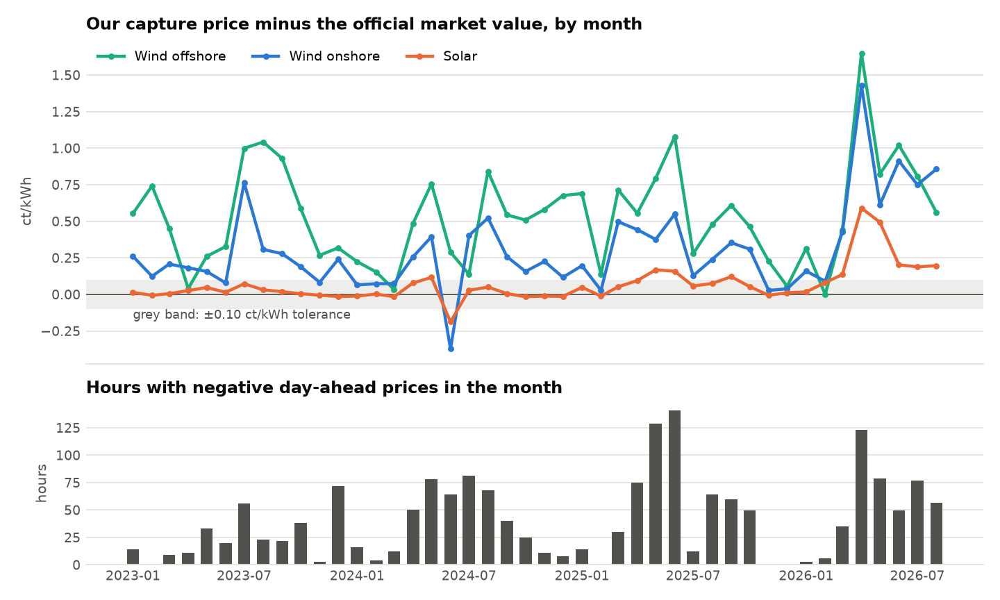
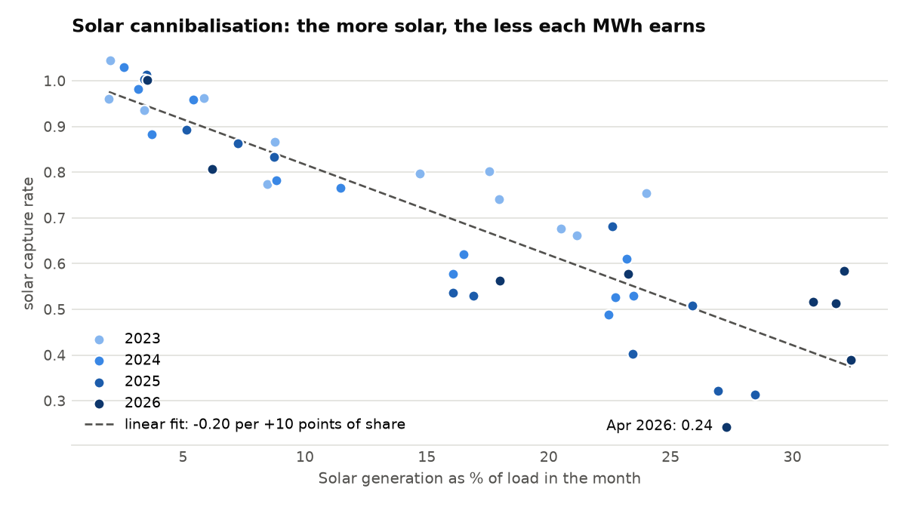

# Day 2 report: capture prices of German solar and wind

Generated 2026-10-08 10:01 UTC by `ppa-lab capture`.
Data: CC BY 4.0 - Bundesnetzagentur | SMARD.de, via Energy-Charts (Fraunhofer ISE). Bidding zone DE-LU,
delivery days 2023-01-01 to 2026-09-30 (local time, Europe/Berlin).
Official market values: netztransparenz.de (file `netztransparenz_market_values_monthly.csv`).

Capture price = sum(price x energy) / sum(energy) over the quarter-hours of the period;
capture rate = capture price / time-weighted base price. Technologies:
Solar, Wind onshore, Wind offshore.

## 1. Capture prices and capture rates by year

| Year             | Technology    |   Base price (EUR/MWh) |   Capture price (EUR/MWh) |   Capture rate |   Energy (TWh) | Energy at negative prices   |
|:-----------------|:--------------|-----------------------:|--------------------------:|---------------:|---------------:|:----------------------------|
| 2023             | Solar         |                  95.18 |                     72.25 |          0.759 |           53.9 | 8.3%                        |
| 2023             | Wind onshore  |                  95.18 |                     78.44 |          0.824 |          115.9 | 5.8%                        |
| 2023             | Wind offshore |                  95.18 |                     86.56 |          0.91  |           23.5 | 4.1%                        |
| 2024             | Solar         |                  78.51 |                     46.48 |          0.592 |           59.7 | 18.3%                       |
| 2024             | Wind onshore  |                  78.51 |                     64.54 |          0.822 |          110.6 | 6.3%                        |
| 2024             | Wind offshore |                  78.51 |                     71.4  |          0.909 |           25.7 | 4.6%                        |
| 2025             | Solar         |                  89.32 |                     45.95 |          0.514 |           70.1 | 24.2%                       |
| 2025             | Wind onshore  |                  89.32 |                     77.27 |          0.865 |          105.1 | 7.6%                        |
| 2025             | Wind offshore |                  89.32 |                     85.53 |          0.958 |           26.1 | 4.4%                        |
| 2026 (to 30 Sep) | Solar         |                 107.72 |                     55.68 |          0.517 |           76.2 | 22.8%                       |
| 2026 (to 30 Sep) | Wind onshore  |                 107.72 |                     95.37 |          0.885 |           77.7 | 7.1%                        |
| 2026 (to 30 Sep) | Wind offshore |                 107.72 |                    101.65 |          0.944 |           20.5 | 5.5%                        |

## 2. Reconciliation with the official annual market values

| metric                             |   year |   ours |   published |   difference |   tolerance | status            |
|:-----------------------------------|-------:|-------:|------------:|-------------:|------------:|:------------------|
| capture_price_solar_ct_kwh         |   2025 |  4.595 |       4.508 |        0.087 |         0.1 | within tolerance  |
| capture_price_solar_ct_kwh         |   2024 |  4.648 |       4.624 |        0.024 |         0.1 | within tolerance  |
| capture_price_solar_ct_kwh         |   2023 |  7.225 |       7.2   |        0.025 |         0.1 | within tolerance  |
| capture_price_wind_onshore_ct_kwh  |   2025 |  7.727 |       7.441 |        0.286 |         0.1 | OUTSIDE tolerance |
| capture_price_wind_onshore_ct_kwh  |   2024 |  6.454 |       6.293 |        0.161 |         0.1 | OUTSIDE tolerance |
| capture_price_wind_onshore_ct_kwh  |   2023 |  7.844 |       7.621 |        0.223 |         0.1 | OUTSIDE tolerance |
| capture_price_wind_offshore_ct_kwh |   2025 |  8.553 |       8.059 |        0.494 |         0.1 | OUTSIDE tolerance |
| capture_price_wind_offshore_ct_kwh |   2024 |  7.14  |       6.777 |        0.363 |         0.1 | OUTSIDE tolerance |
| capture_price_wind_offshore_ct_kwh |   2023 |  8.656 |       8.187 |        0.469 |         0.1 | OUTSIDE tolerance |
| nonnegative_share_solar_pct        |   2025 | 75.773 |      75     |        0.773 |         1   | within tolerance  |
| nonnegative_share_solar_pct        |   2024 | 81.718 |      81     |        0.718 |         1   | within tolerance  |
| nonnegative_share_wind_onshore_pct |   2025 | 92.39  |      90     |        2.39  |         1   | OUTSIDE tolerance |
| nonnegative_share_wind_onshore_pct |   2024 | 93.708 |      92     |        1.708 |         1   | OUTSIDE tolerance |

**8 differences are outside tolerance without a proven cause.** They are open investigations (see `docs/BACKLOG.md`), not accepted errors.

Sources: 2025 capture_price_solar_ct_kwh: netztransparenz.de JW Solar 2025; 2024 capture_price_solar_ct_kwh: netztransparenz.de JW Solar 2024; 2023 capture_price_solar_ct_kwh: netztransparenz.de JW Solar 2023; 2025 capture_price_wind_onshore_ct_kwh: netztransparenz.de JW Wind an Land 2025; 2024 capture_price_wind_onshore_ct_kwh: netztransparenz.de JW Wind an Land 2024; 2023 capture_price_wind_onshore_ct_kwh: netztransparenz.de JW Wind an Land 2023; 2025 capture_price_wind_offshore_ct_kwh: netztransparenz.de JW Wind auf See 2025; 2024 capture_price_wind_offshore_ct_kwh: netztransparenz.de JW Wind auf See 2024; 2023 capture_price_wind_offshore_ct_kwh: netztransparenz.de JW Wind auf See 2023; 2025 nonnegative_share_solar_pct: Roedl & Partner, Wind + Sonne = Strom, Feb 2026: PV-Vermarktungsmenge 2025 = 75 %; 2024 nonnegative_share_solar_pct: Roedl & Partner, Feb 2026: PV-Vermarktungsmenge 2024 = 81 %; 2025 nonnegative_share_wind_onshore_pct: Roedl & Partner, Feb 2026: Wind-an-Land-Vermarktungsmenge 2025 = 90 %; 2024 nonnegative_share_wind_onshore_pct: Roedl & Partner, Feb 2026: Wind-an-Land-Vermarktungsmenge 2024 = 92 %.

## 3. Monthly comparison with the official market values

44 complete months compared (Jan 2023 to Aug 2026).

| Series        |   Months |   Mean difference (ct/kWh) |   Mean absolute difference |   Months within ±0.10 | Largest difference   |
|:--------------|---------:|---------------------------:|---------------------------:|----------------------:|:---------------------|
| Spot (base)   |       44 |                     -0.026 |                      0.027 |                    43 | -1.156 (Jun 2024)    |
| Solar         |       44 |                      0.067 |                      0.081 |                    33 | +0.590 (Apr 2026)    |
| Wind offshore |       44 |                      0.533 |                      0.533 |                     4 | +1.646 (Apr 2026)    |
| Wind onshore  |       44 |                      0.306 |                      0.323 |                     9 | +1.428 (Apr 2026)    |

## 4. What the numbers say

- **Solar:** capture rate 0.76 in 2023 and 0.51 in 2025; in 2025 it earned 43.37 EUR/MWh less than baseload, and 24.2% of its energy was produced at negative prices.
- **Wind onshore:** capture rate 0.82 in 2023 and 0.87 in 2025; in 2025 it earned 12.05 EUR/MWh less than baseload, and 7.6% of its energy was produced at negative prices.
- **Wind offshore:** capture rate 0.91 in 2023 and 0.96 in 2025; in 2025 it earned 3.79 EUR/MWh less than baseload, and 4.4% of its energy was produced at negative prices.

## 5. Charts

